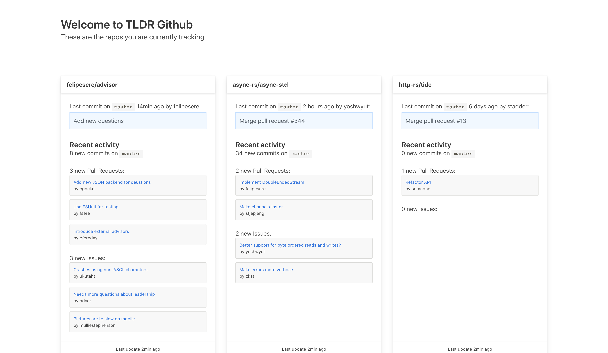

# TLDR GitHub

TLDR Github is a small UI to help you keep track of repositories you are interested and give you an overview of activity.

## Background

You can look at your notifications and activity on GitHub, but that can get flooded with stars and other acticity that adds noise.
The intent here is to have a very narrow scope, but provide a high signal-to-noise ratio.

## Usage

This needs a more details. At the moment, you'd need to boot the app open it in the browser.

## Roadmap

- [x]  Bring in a decent frontend framework
- [/] Provide a UI to add new repos
- [ ] Support the current static view via an API
- [ ] Provide a UI to filter Github issues and pull-requests
- [ ] Bake everything into a single binary

## Changelog

The changelog is maintained in the separate [CHANGELOG.md](CHANGELOG.md) file.

## Thanks

Hopefully [Charlotte](https://github.com/charlottebrf) and [Christoph](https://github.com/christophgockel) will join me!
